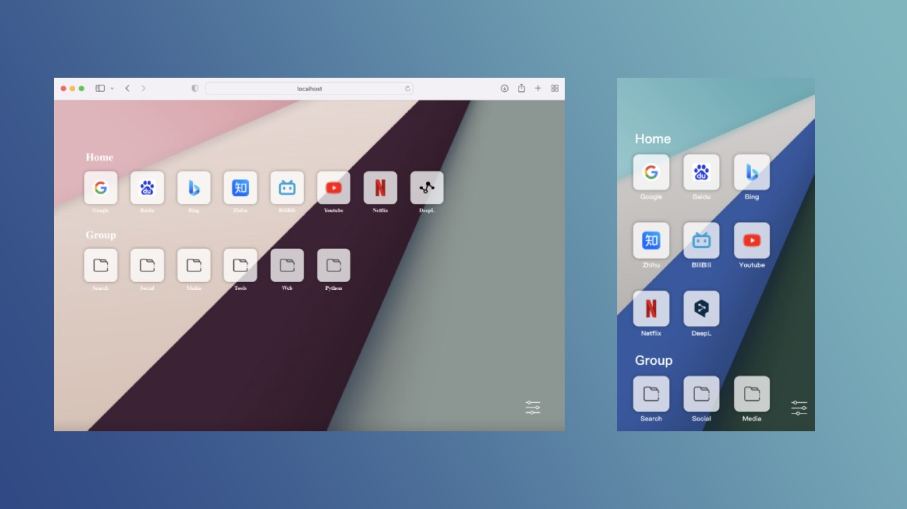
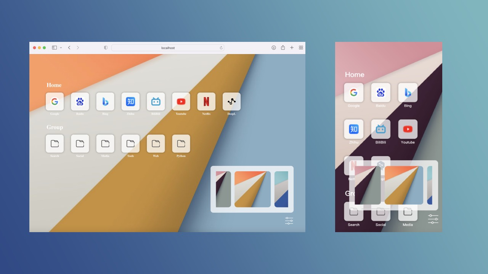

# Safari-like Start Page

Safari-like Start Page



## Installation

1. clone this repo

```shell
# Clone the repo

# Using HTTPS
git clone https://github.com/louisyoungx/safari-like-startpage.git

# Using SSH
git clone git@github.com:louisyoungx/safari-like-startpage.git
```

Once cloned, switch to the master branch and navigate to the folder by typing `cd safari-like-startpage` and then running the following commands:

```shell
# Install all project dependencies
npm install

# Start the project
npm start
```

## User Manual

### config bookmarks

1. Open `src/config/bookmark.ts` file
2. Edit `bookmarksBefore` list

### add wallpaper

1. move wallpaper file to `public/img/wallpaper/` folder
2. Open `src/config/wallpaper.ts` file
3. Edit `wallpaper` list



## License

This project is licensed under the terms of the [MIT License](LICENSE).